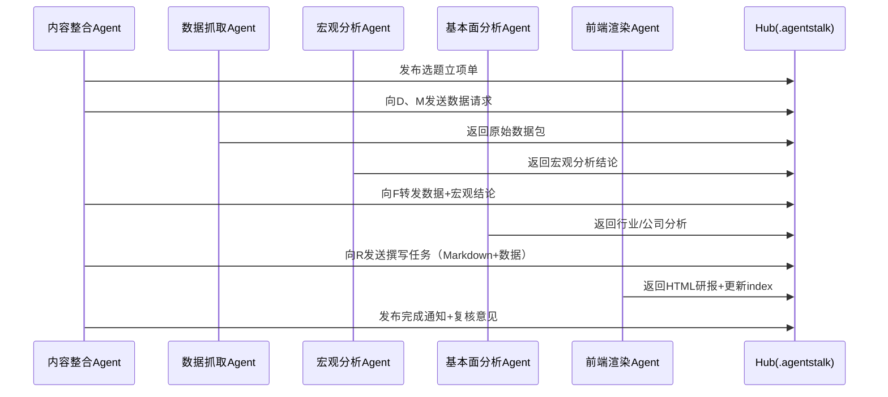

# 多Agent协作标准作业程序（SOP）

> 版本：v1.0  
> 生效日期：2026-04-02  
> 适用范围：投研助手Workspace内所有Agent并行任务与状态同步

---

## 一、协作架构

在投研助手Workspace中，存在以下专职Agent，各自承担不同阶段的任务：

| Agent名称 | 主要职责 | 典型任务 |
|-----------|----------|----------|
| **数据抓取Agent** | 负责原始数据采集、清洗与初步校验 | 抓取宏观数据、行业产销数据、公司财报、高频指标 |
| **宏观分析Agent** | 负责宏观政经解读与政策周期定位 | 分析货币政策、财政政策、地缘政治对目标行业的影响 |
| **基本面分析Agent** | 负责中观行业与微观公司分析 | 产业链拆解、供需模型、财务分析、估值比较 |
| **前端渲染Agent** | 负责可视化与页面构建 | 将Markdown研报渲染为HTML、维护 `index.html`、生成图表 |
| **MCP开发Agent** | 负责工具链沉淀与MCP封装 | 编写数据脚本、封装MCP Server、优化Pipeline |
| **内容整合Agent** | 负责协调各Agent产出，最终汇编为研报 | 发起选题、分配任务、整合内容、质量检查、入库归档 |

---

## 二、通信协议：`.agentstalk/` 目录

### 2.1 目录定位
`.agentstalk/` 是Workspace内所有Agent进行状态同步、任务委派和数据交接的**唯一官方通道**。

> 禁止Agent通过其他隐式渠道（如直接修改彼此工作区文件而不留痕迹）进行协作。

### 2.2 文件命名规范

```
.agentstalk/{timestamp}_{sender}_to_{receiver}_{topic}.md
```

| 字段 | 说明 | 示例 |
|------|------|------|
| `timestamp` | ISO 8601 基本格式（YYYYMMDDTHHMMSS 或 YYYYMMDD） | `20260402T160000` 或 `20260402` |
| `sender` | 发送方Agent标识（小写，短横线连接） | `data-agent` / `macro-agent` / `content-agent` |
| `receiver` | 接收方Agent标识，广播时使用 `all` 或 `hub` | `fundamental-agent` / `frontend-agent` / `hub` |
| `topic` | 主题简述（英文或拼音，小写，短横线连接） | `topic-proposal` / `data-delivery` / `report-review` |

**命名示例**：
- `20260402T160000_content-agent_to_data-agent_data-request.md`
- `20260402_macro-agent_to_all_policy-update.md`
- `20260402_frontend-agent_to_hub_completion-notice.md`

### 2.3 文件内容规范

每份通信文件**必须**包含以下四个部分：

```markdown
# Agent通信文件

## Task Status
- 状态：[IN_PROGRESS / COMPLETED / BLOCKED / REVIEW_NEEDED]
- 优先级：[P0 / P1 / P2]
- 关联任务ID：TASK-2026-XXXX

## Payload
（传递的数据、分析结论、文件路径、关键指标等）

## Next Action
（明确对接收方的执行请求，包含截止时间/预期产出）

## Notes
（补充说明、风险提示、假设条件等）
```

---

## 三、典型协作流程

### 流程A：研报从零到一的完整生产流程



#### 阶段说明与通信示例

**阶段1：选题立项**
- 通信文件：`20260402_content-agent_to_all_topic-proposal.md`
- Payload：研究对象、核心假设、预期产出、任务分配表
- Next Action：数据抓取Agent在T+1日内提供宏观数据包；宏观分析Agent在T+1日内提供政策解读

**阶段2：数据交付**
- 通信文件：`20260402_data-agent_to_content-agent_data-delivery.md`
- Payload：数据文件路径列表、数据说明、数据质量评估
- Next Action：请求基本面分析Agent基于所附数据展开行业分析

**阶段3：宏观分析交付**
- 通信文件：`20260402_macro-agent_to_content-agent_macro-analysis.md`
- Payload：政策周期定位、关键宏观变量、对目标行业的影响映射
- Next Action：请求基本面分析Agent将宏观结论纳入供需模型

**阶段4：基本面分析交付**
- 通信文件：`20260402_fundamental-agent_to_content-agent_fundamental-analysis.md`
- Payload：产业链分析、财务指标表、核心结论与风险提示
- Next Action：请求内容整合Agent汇编Markdown终稿

**阶段5：HTML渲染**
- 通信文件：`20260402_content-agent_to_frontend-agent_render-request.md`
- Payload：Markdown研报正文、数据表、图表需求清单
- Next Action：前端渲染Agent在T+0.5日内输出HTML并更新 `index.json`

**阶段6：入库归档**
- 通信文件：`20260402_frontend-agent_to_hub_completion-notice.md`
- Payload：HTML文件路径、`index.json` 变更说明、页面预览链接
- Next Action：内容整合Agent进行最终质量检查并Git提交

---

### 流程B：MCP开发与工具链沉淀流程

当某次投研分析中出现了可被脚本化/工具化的环节时，MCP开发Agent介入：

1. **触发条件**：内容整合Agent或数据抓取Agent在 `.agentstalk/` 中发布 `tool-request`
2. **需求交付**：通信文件中包含待自动化的流程描述、输入输出格式、使用频率评估
3. **开发反馈**：MCP开发Agent在 `.agentstalk/` 中回复 `tool-prototype`，附带脚本路径和README
4. **集成测试**：发起Agent试用脚本，将测试结果通过 `.agentstalk/` 反馈
5. **正式归档**：通过测试后，脚本/MCP存入 `tools/` 或 `.mcp.json`，并在 `SOP/` 中更新相关文档

---

## 四、状态与异常处理

### 4.1 任务状态定义

| 状态 | 含义 | 处理人 |
|------|------|--------|
| `IN_PROGRESS` | 任务正在执行中 | 执行Agent |
| `COMPLETED` | 任务已完成，产出已交付 | 执行Agent → 接收Agent |
| `BLOCKED` | 任务因外部依赖或数据缺失而暂停 | 执行Agent → 内容整合Agent协调 |
| `REVIEW_NEEDED` | 任务产出需复核，或交叉验证发现矛盾 | 接收Agent → 执行Agent修正 |

### 4.2 异常处理规范

| 异常场景 | 处理方式 |
|----------|----------|
| 数据抓取失败 | 数据抓取Agent发布 `BLOCKED` 状态，说明失败原因和替代方案；内容整合Agent决定是否延期或缩小研究范围 |
| 分析结论出现逻辑矛盾 | 基本面分析Agent发布 `REVIEW_NEEDED` 状态，附矛盾点说明；相关Agent在 `.agentstalk/` 中辩论并达成一致 |
| HTML渲染阻塞 | 前端渲染Agent发布 `BLOCKED` 状态，说明缺失的图表/数据；内容整合Agent协调补齐 |
| 多Agent同时修改同一文件 | 遵循"Hub仲裁"原则：内容整合Agent（或指定仲裁Agent）统一合并，其他Agent不直接修改最终产出文件 |

### 4.3 清理机制

- `.agentstalk/` 中的通信文件在任务完结后**保留至少30天**，用于审计和回溯。
- 超过30天的文件可由MCP开发Agent编写脚本自动归档至 `.agentstalk/archive/YYYYMM/`。

---

## 五、纪律与最佳实践

1. **所有通信必须留痕**：口头/隐式协作无效，一切状态变更以 `.agentstalk/` 文件为准。
2. **Payload要具体**：避免空泛描述，文件路径、数据版本、关键指标必须精确。
3. **Next Action要明确**：必须包含对接收方的具体指令、预期产出、截止时间。
4. **优先使用Markdown**：`.agentstalk/` 通信文件统一使用 `.md` 格式，便于人读和脚本解析。
5. **静默通信，高噪输出**：多Agent间通信细节留在 `.agentstalk/` 中，最终呈现给用户的研报和UI保持简洁专业。

---

## 六、相关文件

| 文件 | 路径 |
|------|------|
| 研报撰写SOP | `SOP/研报撰写SOP.md` |
| 通信示例 | `.agentstalk/20260402_content-agent_to_hub_completion-notice.md` |
| 工具链目录 | `tools/` |
| MCP配置 | `.mcp.json`（待创建） |
